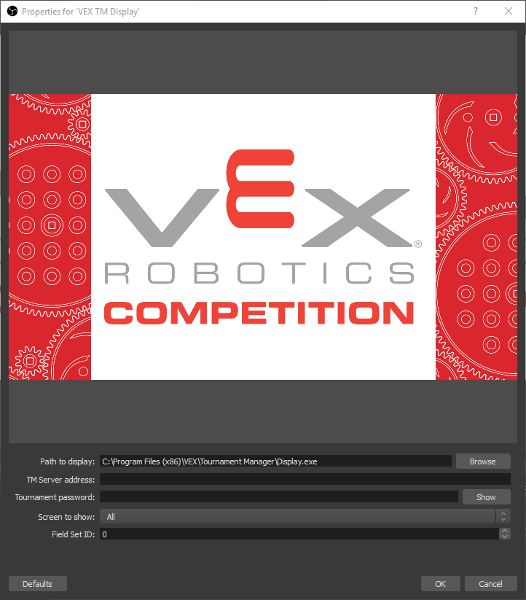

# vextm-obs-source

VEX Tournament Manager display source plugin for OBS Studio.

## Support

Please note this is *unofficial software*. It is not supported or endorsed by VEX Robotics or the REC Foundation in any way. Please do not contact VEX or RECF with any issues related to this plugin.

If you think you have found a bug, please [log an issue](https://gitlab.com/dwabtech/vextm-obs-source/issues). We request that you do not use the issue tracker for support requests.

## Download

Binaries for Windows 64 bit are available in the [Releases](https://gitlab.com/dwabtech/vextm-obs-source/-/releases) section.

## Installation

First, ensure you are using the 64-bit version of OBS Studio. The 32-bit Windows version as well as macOS and Linux versions aren't supported at this time.

The plugin is distributed as a ZIP file. To install, unzip the downloaded file to the OBS Studio installation directory, typically:

> C:\Program Files\obs-studio

After that, just restart OBS Studio and it should load the new plugin.

## Usage

**NOTE**: It is not advisble to run OBS Studio on the same computer which is being used for scorekeeping with Tournament Manager or acting as the Tournament Server. Use a separate PC dedicated to OBS Studio with a network connection to Tournament Manager.

This plugin requires Tournament Manager to be installed on the PC. Make sure you've installed the latest version before attempting to use the plugin.

Plugin usage is simple. In OBS Studio, select your desired scene and then click the `+` button under `Sources`. Choose `VEX TM Display`.  You will be prompted for some settings. For a normal TM installation, `Path to display` should not need to be changed. Server address and tournament password should be filled in as appropriate - this is similar to setting up a remote TM display on another computer.

`Screen to show` allows you to "pin" the display source to a single display type. You might use this for example to create a source that always has the rankings available if you want to transition to that in between matches (rather than requiring the scorekeeper to do it using TM's built-in display controls). For basic usage, just leave this set to `All`.

`Field Set ID` can be left at 0 if you are not using more than a single field set in Tournament Manager. If you are using more than 1 field set, you can also leave this value at 0 and then you will get a separate prompt from the TM display program asking you to choose your field set. Otherwise, you can set this value to your field set ID so that you can shut down OBS Studio and restart it without being prompted by TM. Unfortuatnely, there is currently no easy way to look up a field set ID, however in most cases the field set IDs simply start at 1 and count up from there, so finding it by trial and error shouldn't be hard.
